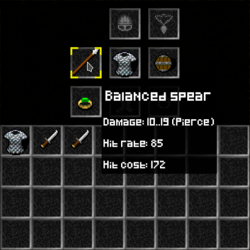

# bevy roguelike

Meet my new baby. It lives [here](https://tomuxmon.github.io/bevy_roguelike/). A turn based system where each actor has combat capabilities influenced by equiped items. I had a burning desire to learn [Rust](https://www.rust-lang.org/). It appears I also like creating games. Wonderful [Bevy](https://bevyengine.org/) engine was used. Bevy uses only 4 letters to define itself, and so it is concise, and so is Rust. Also humans tend to forget what is in the middle of the text. No one will remember this sentence. Jokes aside It felt really natural to define data structures and write systems that manipulate those data structures. This is my first Rust project so bugs are possible as much as Rust and Bevy allows it. Preview of the running system below.


## Running it

To run this game locally you need [rust installed](https://www.rust-lang.org/tools/install). Then you can run it with:

- `cargo run` (the usual rust build)

If you would like to try it in the browser (inspiration from [bevy_game_template](https://github.com/NiklasEi/bevy_game_template)) you will also need to [install trunk](https://trunkrs.dev/#install), add `wasm32-unknown-unknown` rust target with `rustup target add wasm32-unknown-unknown` command. Then you can try it with:

- `trunk serve` (serve wasm build)

Check out the [live version here](https://tomuxmon.github.io/bevy_roguelike/).

You can also run and debug it inside VS Code with breakpoints and all the goodness. [launch.json](.vscode/launch.json) together with a couple of extensions allows that. Personally I just use [rust-extension-pack](https://marketplace.visualstudio.com/items?itemName=Zerotaskx.rust-extension-pack).

### Controlls

- `up` / `down` / `left` / `right` keys for movement and attack
- `space` skip turn
- `Z` skip turns continuously and heal
- `,` to pick up item
- `I` to open / close inventory display
- `D` to drop item (last item from inventory or else equipment)

### Inventiory management



- `hover` over an item in the inventory / equipment to display a hover tip
- `mouse click` an item to equip / unequip it

## implementation details

This project was developed with an effort to separate distinct concerns into crates as much as possible. Same as bevy engine does it. There are 3 noteworthy crates usable independantly:

- [bevy_inventory](bevy_inventory/)
- [bevy_inventory_ui](bevy_inventory_ui/)
- [bevy_roguelike_combat](bevy_roguelike_combat/)

Separate crates are discussed below.

### bevy inventory

This crate contains basic implementation of the inventory and equipment containers. Items are Bevy's [Entities](https://docs.rs/bevy/latest/bevy/prelude/struct.Entity.html). Both inventory and equipment implement utility methods to `take` and `add` items. The only difference between inventory and equipment is that the equipment also has a generic type parameter to specify item type. Inventory and Equipment structures below.

```rust
//...

pub trait ItemType: Component + Copy + Clone + Eq + Hash + Debug + Default {}

#[derive(Debug, Clone, Component)]
pub struct Inventory {
    items: Vec<Option<Entity>>,
}

#[derive(Debug, Default, Clone, Component)]
pub struct Equipment<I: ItemType> {
    pub items: HashMap<(I, u8), Option<Entity>>,
}
//...
```

ItemType is a trait that needs to be implemented in user code. Something like this:

```rust
#![allow(dead_code)]
use bevy::prelude::*;
use bevy_inventory::ItemType;

/// deriving traits required by `ItemType`
#[derive(Debug, Default, Copy, Clone, PartialEq, Eq, Hash, Component)]
pub enum SomeItemType {
    #[default]
    RightHandGear,
    LeftHandGear,
    BodyWear,
}
/// manaully implementing. no macro for that so far.
impl ItemType for SomeItemType {}
```

`bevy_inventory` is really minimal and it does not contain any bevy systems also there is no plugin for it. To use it just copy it into your workspace or just copy paste what you actually need. If you have some suggestions or know something better that I could use instead please mention it in the discussions.

### bevy inventory ui

This crate contais the implementation of the InventoryDisplay and tooltips both in the world and the ui. To use it first you need to implement a custom ItemType as mentioned in the inventory section. Then implement `ItemTypeUiImage` for your custom item type:

```rust
use bevy_inventory_ui::ItemTypeUiImage;

#[derive(Debug, Clone)]
pub struct InventoryAssets {
    pub body_wear: Handle<Image>,
    pub right_hand_gear: Handle<Image>,
    pub left_hand_gear: Handle<Image>,
}

impl ItemTypeUiImage<SomeItemType> for InventoryAssets {
    fn get_image(&self, item_type: SomeItemType) -> UiImage {
        match item_type {
            SomeItemType::RightHandGear => self.right_hand_gear.clone(),
            SomeItemType::LeftHandGear => self.left_hand_gear.clone(),
            SomeItemType::BodyWear => self.body_wear.clone(),
        }
        .into()
    }
}
```

You will also need to manually add `InventoryUiAssets` resource:

```rust
cmd.insert_resource(InventoryUiAssets {
    slot: asset_server.load("sprites/gui/inventory/slot.png"),
    hover_cursor_image: asset_server.load("sprites/gui/tooltip/cursor.png"),
    font: asset_server.load("fonts/pixeled.ttf"),
});
```

Then you can add `InventoryUiPlugin`

```rust
//...
.add_plugin(InventoryUiPlugin::<_, SomeItemType, InventoryAssets> {
    state_running: AppState::InGame,
    phantom_1: PhantomData {},
    phantom_2: PhantomData {},
})
//...
```

If you know how to eliminate `PhantomData` give it a shout. Here `state_running` is a State where most of the ui systems are running.
After all that is in place your actors then must have inventory and equipment components in place: `EquipmentDisplay<SomeItemType>` to be able to diplay UI and `Equipment<SomeItemType>` with `Inventory` as underlying containers. to open or close inventory display you must send `InventoryDisplayToggleEvent` event. The result should be similar to what can be seen in the [inventiory management](#inventiory-management) section.

Not really related to the inventory but still in the same crate there is a tooltip implementation. To enable tooltip you just need to fill in `UiTextInfo` for both world entities and UI nodes. It uses fixed z hack. Tooltips are placed at `10.` z.

#### UI afterthoughts

All ot the UI was implemented using bevy ui library. It is not the most pleasant way to work with UI and the resulting code has a lot of boilerplate. Also looked at bevy_egui, for some reason it did not fit well with this project. Again if you know better alternatives (inventory ui or ui library) please give it a shout.

### bevy roguelike combat

As name suggests this crate takes care of the brutal interaction between actors in your environment. To use Roguelike combat you need to implement 2 traits: `DamageKind` and `AttributeType`. in code it would look similar to example below.

```rust
#![allow(dead_code)]
use bevy::{prelude::*, reflect::FromReflect};
use bevy_roguelike_combat::*;
use std::fmt::Display;
use strum_macros::EnumIter;

#[derive(Debug, Default, Clone, PartialEq, Eq, Hash, Component, Reflect, FromReflect, EnumIter)]
#[reflect(Component)]
pub enum SimpleAttribute {
    #[default]
    Strength,
    Inteligence,
}
impl Display for SimpleAttribute {
    fn fmt(&self, f: &mut std::fmt::Formatter<'_>) -> std::fmt::Result {
        write!(
            f,
            "{}",
            match self {
                SimpleAttribute::Strength => "str",
                SimpleAttribute::Inteligence => "int",
            }
        )
    }
}
impl AttributeType for SimpleAttribute {}

#[derive(Debug, Default, Clone, Copy, PartialEq, Eq, Hash, Component, Reflect, FromReflect)]
#[reflect(Component)]
pub enum SimpleDamage {
    #[default]
    Physical,
    Magical,
}
impl Display for SimpleDamage {
    fn fmt(&self, f: &mut std::fmt::Formatter<'_>) -> std::fmt::Result {
        write!(f, "{:?}", self)
    }
}
impl DamageKind for SimpleDamage {}
```

Dependency on [strum_macros](https://crates.io/crates/strum_macros) is needed so we can enumerate enums. Everything else is Bevy and standard Rust specific. Having those two implemented you can then hook up `RoguelikeCombatPlugin`.

```rust
//...
.add_plugin(
    RoguelikeCombatPlugin::<_, SimpleDamage, SimpleAttribute> {
        state_running: self.state_running.clone(),
        phantom_1: PhantomData {},
        phantom_2: PhantomData {},
    },
)
//...
```

When plugin is loaded you also need to give your actors all the required components. Just use the `Combat` bundle.

```rust

let attributes = Attributes::<SimpleAttribute>::with_all(10);

let ap_increment_formula = LinearFormula {
    scale: 4096,
    multipliers: vec![
        Multiplier {
            attribute: SimpleAttribute::Inteligence,
            multiplier: 50,
        },
        Multiplier {
            attribute: SimpleAttribute::Strength,
            multiplier: 50,
        },
    ],
};
let hp_full_formula = LinearFormula::one();
let hp_regen_increment_formula = LinearFormula::one();

let damage = DamageList {
    list: vec![Damage {
        kind: SimpleDamage::Physical,
        amount: 10..20,
        amount_multiplier: LinearFormula::one(),
        hit_cost: ActionCost {
            cost: 128,
            multiplier_inverted: LinearFormula::one(),
        },
        hit_chance: Rate {
            amount: 128,
            multiplier: LinearFormula::one(),
        },
    }],
};

let protection = Protection {
    amounts: vec![Protect {
        kind: SimpleDamage::Magical,
        amount_multiplier: LinearFormula::one(),
        amount: 5,
    }],
};

let evasion = Evasion {
    cost: ActionCost {
        cost: 32,
        multiplier_inverted: LinearFormula::one(),
    },
    chance: Rate {
        amount: 96,
        multiplier: LinearFormula::one(),
    },
};

let resistance = Resistance {
    amounts: vec![Resist {
        kind: SimpleDamage::Magical,
        percent: 30,
    }],
};

let combat = Combat::new(
    &attributes,
    ap_increment_formula,
    hp_full_formula,
    hp_regen_increment_formula,
    damage,
    protection,
    evasion,
    resistance,
);

```

Wow that is a lot of characters to type in 😃. For breviety purposes most of the formulas are just placeholders always returning `1.`. In your own project you are probably better off using something like [bevy_asset_ron](https://github.com/IyesGames/bevy_asset_ron) and define your actor capabilities in your asset files. Check out [actor_template.rs](bevy_roguelike_plugin/src/resources/actor_template.rs) and [actor bundle](bevy_roguelike_plugin/src/components/actor/mod.rs) for example.
This crate is decoupled from other crates like inventory. That means that you will have to manually take care of some stuff.

- Fill `StatsComputed` in your code in order for combat system to work (example system [stats_recompute](bevy_roguelike_plugin/src/systems/actor_stats.rs)).
- Handle `ActionCompletedEvent` events (example system [action_completed](bevy_roguelike_plugin/src/systems/turns.rs)).
- Handle `DeathEvent` events (example system [death_read](bevy_roguelike_plugin/src/systems/action.rs)).

For formulas I could probably create a parser with [Nom](https://github.com/Geal/nom) or just use expressions from something like [rhai](https://crates.io/crates/rhai). But maybe later™. For now it sattisfies the needs of the main game plugin. Any suyggestions are welcome.

### map generator

This crate is a direct result of reading the [Hands-on Rust](https://pragprog.com/titles/hwrust/hands-on-rust/) book. Many thanks to Herbert Wolverson, author of the book! Since the underlying algorithms and structures are independant, there is no need to depend on bevy. The most interesting part of it is the drunkard map generator (`DrunkardGenerator`). the algorithm is so simple and the results are mostly satisfying. `ConwayLifeGenerator` also produces interesting results but it happens most of the time that unreachable regions are present in the map. no pathfinding algorithms were used so far and there is no way to validate the generated map. This crate is still in a TODO phase but was sufficient to test and develop bevy game systems. Yet again if you know better alternatives please give it a shout.

### vec walk dir

They say you can not [load asset folder on the web](https://github.com/bevyengine/bevy/issues/2916). Yes it is true. But yet again, we know asset folder structure at compile time. A dirty macro workaround to the rescue. It is not a good idea to rely on reading folder structure in a macro. But I wanted to write my first macro.

```rust
#[cfg(target_arch = "wasm32")]
{
    let asset_files: Vec<&str> = vec_walk_dir::vec_walk_dir!("assets");
    for file in asset_files.into_iter() {
        asset_server.load_untyped(file);
    }
}
```

#### Inspiration and learning sources

- [The Little Book of Rust Macros](https://veykril.github.io/tlborm/introduction.html)
- [Procedural Macros tutorial series](https://blog.turbo.fish/proc-macro-basics/)

### bevy roguelike plugin

This crate is a spahgeti soup of code that uses the rest of the crates and defines things like [item templates](bevy_roguelike_plugin/src/resources/item_template.rs), [actor templates](bevy_roguelike_plugin/src/resources/actor_template.rs), [field of view](bevy_roguelike_plugin/src/systems/fov.rs), [turns](bevy_roguelike_plugin/src/systems/turns.rs).

The biggest influence on this project was from [Hands-on Rust](https://pragprog.com/titles/hwrust/hands-on-rust/) book and [Bevy Minesweeper](https://dev.to/qongzi/bevy-minesweeper-introduction-4l7f) tutorial series. Go ahead and check them out! Have fun exploring 🦊.

## License

Using the same license as bevy engine does.

- MIT License ([LICENSE-MIT](LICENSE-MIT) or [http://opensource.org/licenses/MIT](http://opensource.org/licenses/MIT))
- Apache License, Version 2.0 ([LICENSE-APACHE](LICENSE-APACHE) or [http://www.apache.org/licenses/LICENSE-2.0](http://www.apache.org/licenses/LICENSE-2.0))

## Credits

None of this would be possible if not the [wonderful work done by others](credits/CREDITS.md). This is my first rust project so "would be possible" applies even more :).
